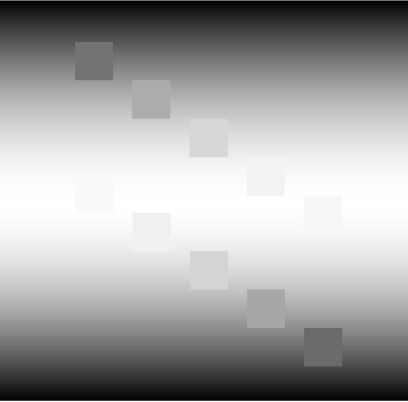
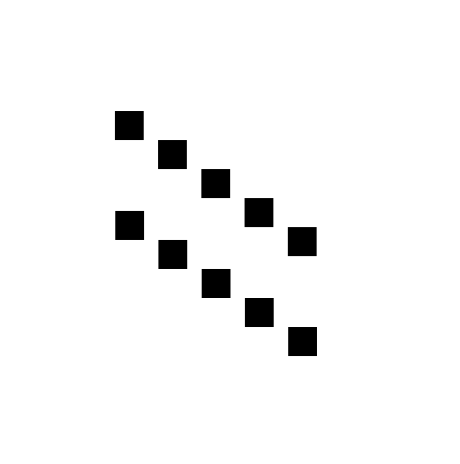
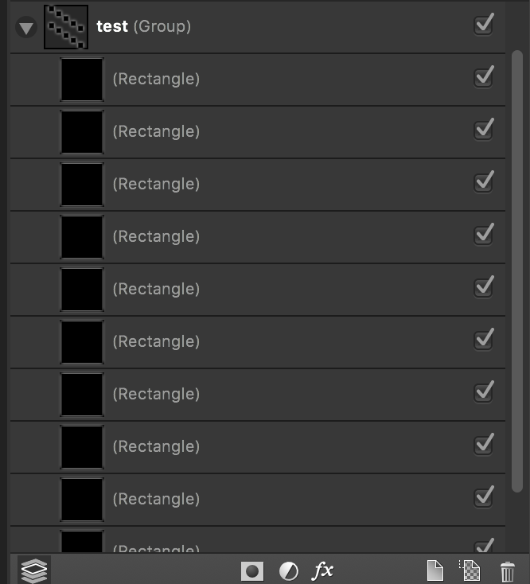
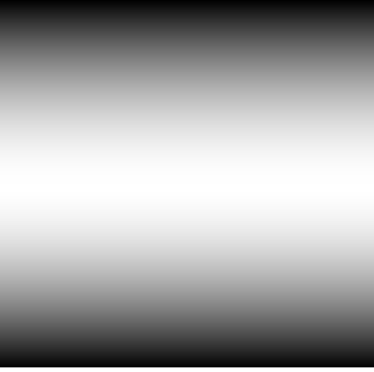

# OddLED


OddLed is a command-line tool to generate output arrays for addressable leds for non-standard LED layout (e.g. custom PCB layouts or just arranged strips)

## Why
Sometimes, LEDS are a grid or straight line.. sometimes youre printing PCBS for LED text or sometimes your just aligning leds in a weird orientation. OddLED makes creating LED mappings easy

## Features
- Written in Python
- Creates bitmaps using Photoshop files of LED layouts for unconventional led layouts.
- Supports multiple LED data lines (as seperate layers in the photoshop file)
- Works with either single files as well as folders to generate full effects at a single time

## Installation
To run the tool, you only need Python but if you want to make the masks.. you need a software that can create images on layers and the ability to export as a PSD.
To make the mask, here are some Applications:
- Affinity Designer ($)
- Photoshop ($$)
- Illustrator ($$)
- GIMP (free)

OddLED requires Python2 and a few 3rd Party Libraries
To install python on Mac:
```
brew install python
```
To install Python on Debian/Ubuntu:
```
sudo apt-get install python
```

PIP should be installed on Python 2 >=2.7.9 but if you dont have it go [here](https://pip.pypa.io/en/stable/installing/)

Once you have Pip, run:
```
pip install Pillow
```
```
pip install PSD_tools
```

# How to:
- First, you need to make the LED mask, each LED data line (driven by a different IO pin) should be a seperate layer and the LEDs should be paced in order of the actual LEDS. In the example below, I am adding a gradient across two diagonal rows of LEDS:
This is the LED layout:


All of the LEDs are on the same Data line thus they are all in a single group called "test". Inside the group are the leds, as simple rectangle objects. The rectangles are ordered in order of the physical LEDs.  


<!--  -->
The mask should be saved as a PSD file as it stores all the layers. 

- Next create your effect to overlay. This is whatever you want to show on the LEDS. For the example, I created a gradient that fades outward
<!--  -->


- The commandline tool takes an input mask (as a PSD file, where each led is a seperate layer). An effect image of the same size, and an ouput file (default is stdout)
Basic Usage is shown:
```
 Tyler$ python led_controller.py -h
usage: led_controller.py [-h] -m MASK -i INPUT [-c [COLOR_MODE]] [-v]

Creates bitmaps using Photoshop files of LED masks for unconventional led
layouts.

optional arguments:
  -h, --help            show this help message and exit
  -m MASK, --mask MASK  Photoshop file of the LED positions.
  -i INPUT, --input INPUT
                        Photo (or Folder) of the input to overlay on to the
                        LEDS. This should be the same pixel size as the mask!
  -c [COLOR_MODE], --color_mode [COLOR_MODE]
                        Color mode of input image: (L,RGB)
  -v, --verbose         Increase verbosity of ouput
```

Sample Usage:
This runs applies the sample effect (gradient) to the led mask.
```
    python oddLED.py -m sampleLED.psd -e sampleEffect.png

```
This will print:
```
const uint8_t test_sample_effect[10][3] =  {{107, 107, 107}, {167, 167, 167}, {212, 212, 212}, {240, 240, 240}, {249, 249, 249}, {247, 247, 247}, {242, 242, 242}, {215, 215, 215}, {172, 172, 172}, {115, 115, 115}}
```
the tool generates 2d arrays of the RGB values. in the example, the RGB values are the same since the image is grey scale so we can just use the greyscale option which is designated by "L", ill also add verbose flag.

```
    python oddLED.py -m sampleLED.psd -e sampleEffect.png  -v --color_mode L

```
Outputs:
```
Input File: sample_effect.png
Found 1 LED data lines
These are the following layers:
   test


const uint8_t test_sample_effect[10] =  {107, 167, 212, 240, 249, 247, 242, 215, 172, 115}

```
As you can see, the name of the array is generated by the name of the photoshop group "test" (sorry for the bad naming), followed by the name of the effect image ("sample_effect")


## TODO
 - generate output sample images
 - support more color modes
 - support more LED mask file types (Illustrator, etc.)
